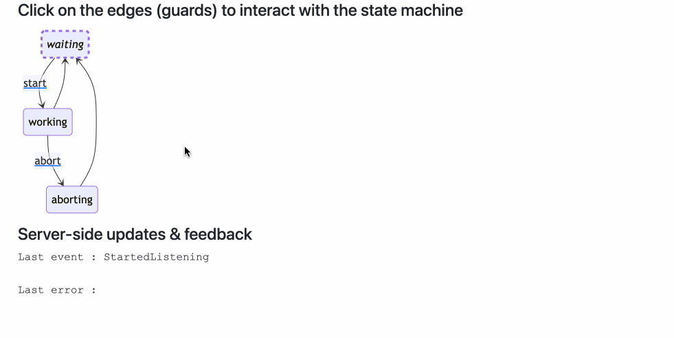
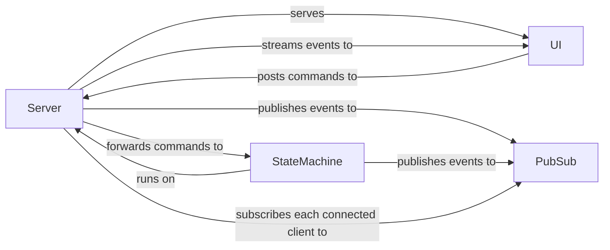

# Mermaid Diagram Live Update Demo

## Running

```bash
go run ./cmd/mermaidlive
```

&darr;

[http://localhost:8080/ui/](http://localhost:8080/ui/)



- to change the default countdown delay, provide the option, e.g. `-delay 150ms`

### Embedded Resources

to only generate UI resources from [ui-src](./ui-src), run:

```shell
go run ./cmd/mermaidlive -transpile
```

to build a binary with embedded UI:

```shell
go build --tags=embed ./cmd/mermaidlive
```

## Ideas Sketched in the Spike

- developer experience of live reload [back-end](./watch.go) &rarr; `ResourcesRefreshed` &rarr; [front-end](./ui-src/index.ts)
- UI served from a [binary-embedded filesystem](./resources.go)
- pub-sub [long-polling](https://ably.com/topic/long-polling) connected clients and live viewers
- [asynchronously running state machine](./async_fsm.go) observable via published events
- live re-rendering of a mermaid chart via events
- initial rendering of a chart via the `LastSeenState` event published upon connecting to the stream
- deployment on fly.io
- sharing Gherkin features between unit, API and Browser tests, and sharing step implementations between scenarios
- asynchronously connected client tests: two API and Browser clients
- long poll re-connects and showing the connection status to the user
- a persistent distributed [G-Counter (grow-only counter)](https://en.wikipedia.org/wiki/Conflict-free_replicated_data_type#G-Counter_(Grow-only_Counter)) CRDT for started connections that is eventually-consistent, once service replicas see each other
  - service discovery via [fly.io internal DNS](https://fly.io/docs/networking/private-networking/#fly-io-internal-dns) polling
  - [replication](https://github.com/d-led/percounter/blob/main/zmq_single_gcounter_test.go) via a fully-connected [ZeroMQ](https://github.com/go-zeromq/zmq4) ineternal network mesh
  - a simple persistence of the CRDT counter in a continuously re-written [JSON-structured file](https://github.com/d-led/percounter/blob/main/persistent_gcounter_test.go) located on machine-bound [fly.io volumes](https://fly.io/docs/volumes/overview/#volume-considerations)
  - not using a separately deployed database for the CRDT 

## Architecture



## Testing

- the [specification](./features/) contains shared steps
- state machine-level "unit" [test steps](./unit_steps_test.go)
  - exececise the async state machine
- API-level [test steps](./api_steps_test.go)
  - start the server at port `8081`
  - exercise the specification, including scenarios tagged with `@api`
- Browser-level: [test steps](./src/steps/ui.steps.ts)

### Unit

```shell
go test -v ./...
```

### API-based

- the test starts a temporary server instance and runs the tests against it

```shell
./scripts/test-api.sh
```

### Browser-based

- the test uses [Playwright](https://playwright.dev/) via the [cucumber-playwright](https://github.com/Tallyb/cucumber-playwright) template
- prerequisites:
  - install dependencies: `npm i`
  - initialize Playwright: `npx playwright install`
- start the server first, e.g.:

```shell
./scripts/run-dev.sh -delay 150ms
```

- run the tests:

```shell
./scripts/test-ui.sh
```

## Approach

- [Mermaid API](https://mermaid.js.org/config/setup/modules/mermaidAPI.html)
- [JSON Streaming](https://en.wikipedia.org/wiki/JSON_streaming)
- Identifiable concurrent processes are modeled with [phony (Go)](https://github.com/Arceliar/phony)
- Distributing shared state from the server to client connections via [Pub/Sub](https://github.com/cskr/pubsub)

## Deployment

- currently deployed on [fly.io](https://fly.io/) &rarr; [mermaidlive.fly.dev](https://mermaidlive.fly.dev/)
- [docker compose](./docker-compose.yml)

## Experiments

### Observing Replication in Docker

to start 3 initial replicas:

```shell
docker compose up -d
```

&rarr; visit and reload the UI: [http://localhost:8080/](http://localhost:8080/)

stop 2 replicas:

```shell
docker stop mermaidlive-mermaidlive-2 mermaidlive-mermaidlive-3
```

&darr;

log:

```log
mermaidlive-1 | Peers changed [172.19.0.4 172.19.0.5] -> []
```

reload the UI a couple of times and re-start the replicas:

```shell
docker start mermaidlive-mermaidlive-2 mermaidlive-mermaidlive-3
```

&darr;

log:

```log
mermaidlive-1 | Peers changed [] -> [172.19.0.4 172.19.0.5]
mermaidlive-1 | Connecting to tcp://[172.19.0.4]:5000
mermaidlive-1 | Connecting to tcp://[172.19.0.5]:5000
mermaidlive-2 | New visitor count: 25
mermaidlive-3 | New visitor count: 25
mermaidlive-2 | Peers changed [172.19.0.2] -> [172.19.0.2 172.19.0.5]
mermaidlive-2 | Connecting to tcp://[172.19.0.5]:5000
mermaidlive-3 | Peers changed [172.19.0.2] -> [172.19.0.2 172.19.0.4]
mermaidlive-3 | Connecting to tcp://[172.19.0.4]:5000
```

observe, how the replicated visitor count is propagated to the replicas.

Scale replicas for further experiments, e.g.:

```shell
docker compose scale mermaidlive=5
```
