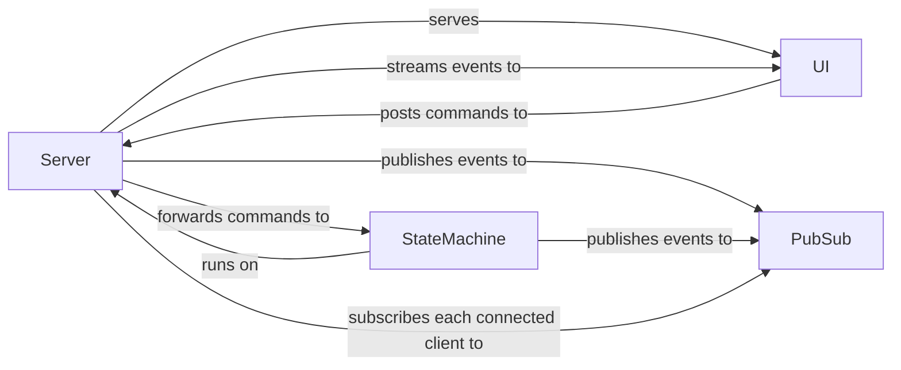

# Mermaid Diagram Live Update Demo

## Running

```bash
go run .
```

&darr;

[http://localhost:8080/ui/](http://localhost:8080/ui/)


### Embedded Resources

to only generate UI resources from [ui-src](./ui-src), run:

```shell
go run . -transpile
```

to build a binary with embedded UI:

```shell
go build --tags=embed .
```

## Architecture



## Testing

- WIP
- "test-after" as a spike in itself
- the demo revolves around reusing the [specification](./features/)

### Unit

```shell
go test -v ./...
```

## Approach

- [Mermaid API](https://mermaid.js.org/config/setup/modules/mermaidAPI.html)
- [JSON Streaming](https://en.wikipedia.org/wiki/JSON_streaming)

## Deployment

- currently deployed on [fly.io](https://fly.io/) &rarr; [mermaidlive.fly.dev](https://mermaidlive.fly.dev/)
