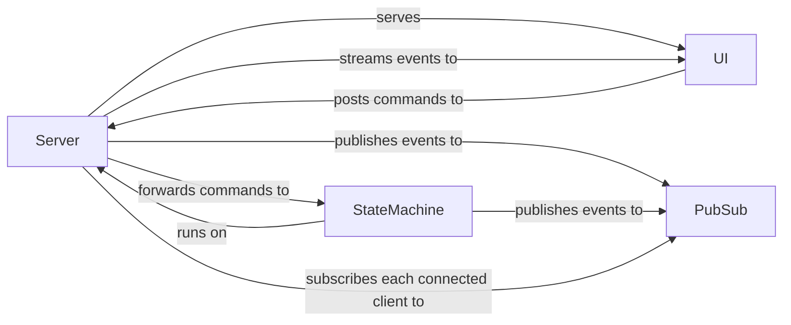

# Mermaid Diagram Live Update Demo

## Running

```bash
go run ./cmd/mermaidlive
```

&darr;

[http://localhost:8080/ui/](http://localhost:8080/ui/)


- to change the default countdown delay, provide the option, e.g. `-delay 150ms`

### Embedded Resources

to only generate UI resources from [ui-src](./ui-src), run:

```shell
go run ./cmd/mermaidlive -transpile
```

to build a binary with embedded UI:

```shell
go build --tags=embed ./cmd/mermaidlive
```

## Architecture



## Testing

- WIP
- "test-after":
  - the [specification](./features/) contains shared steps
  - state machine-level [test steps](./unit_steps_test.go)
    - exececise the async state machine
  - API-level [test steps](./api_steps_test.go)
    - start the server at port `8081`
    - exercise the specification, including scenarios tagged with `@api`

### Unit

```shell
go test -v ./...
```

### API-based

- the test starts a temporary server instance and runs the tests against it

```shell
./scripts/test-api.sh
```

### Browser-based

- the test uses [Playwright](https://playwright.dev/) via the [cucumber-playwright](https://github.com/Tallyb/cucumber-playwright) template
- start the server first, e.g.:

```shell
./scripts/run-dev.sh -delay 150ms
```

- run the tests:

```shell
./scripts/test-ui.sh
```

## Approach

- [Mermaid API](https://mermaid.js.org/config/setup/modules/mermaidAPI.html)
- [JSON Streaming](https://en.wikipedia.org/wiki/JSON_streaming)
- Identifiable concurrent processes are modeled with [phony (Go)](https://github.com/Arceliar/phony)
- Distributing shared state from the server to client connections via [Pub/Sub](https://github.com/cskr/pubsub)

## Deployment

- currently deployed on [fly.io](https://fly.io/) &rarr; [mermaidlive.fly.dev](https://mermaidlive.fly.dev/)
